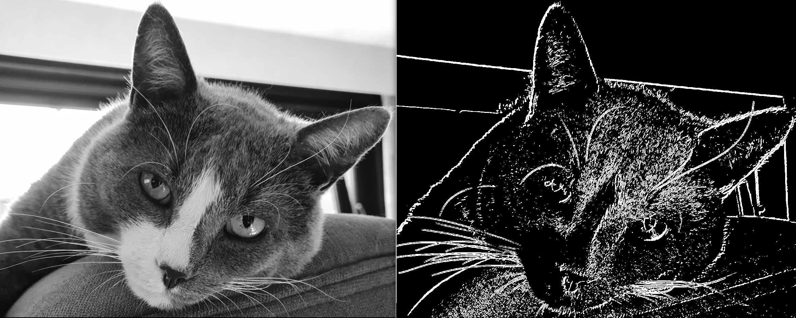
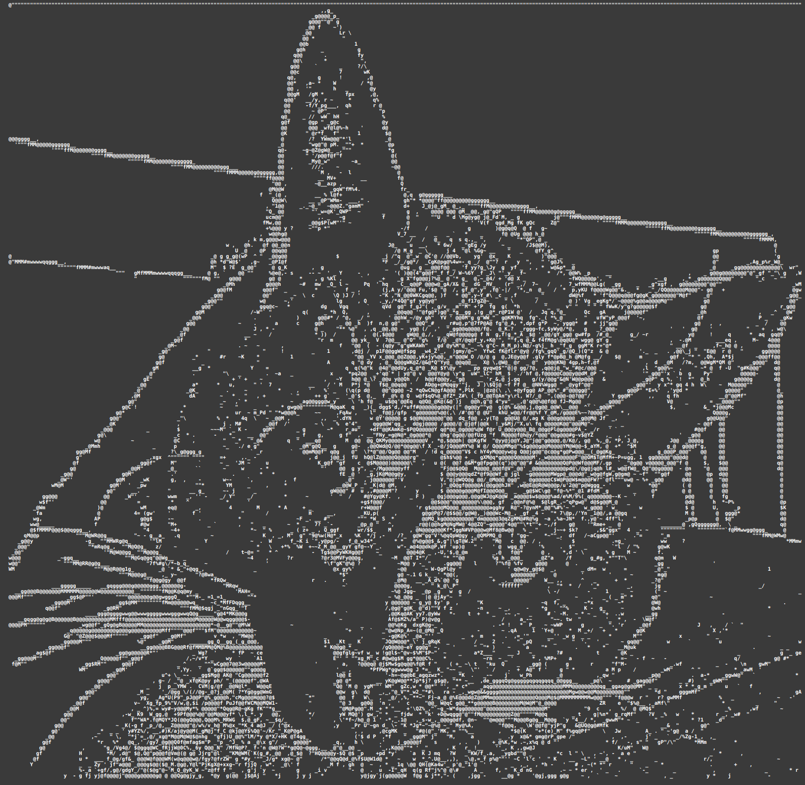
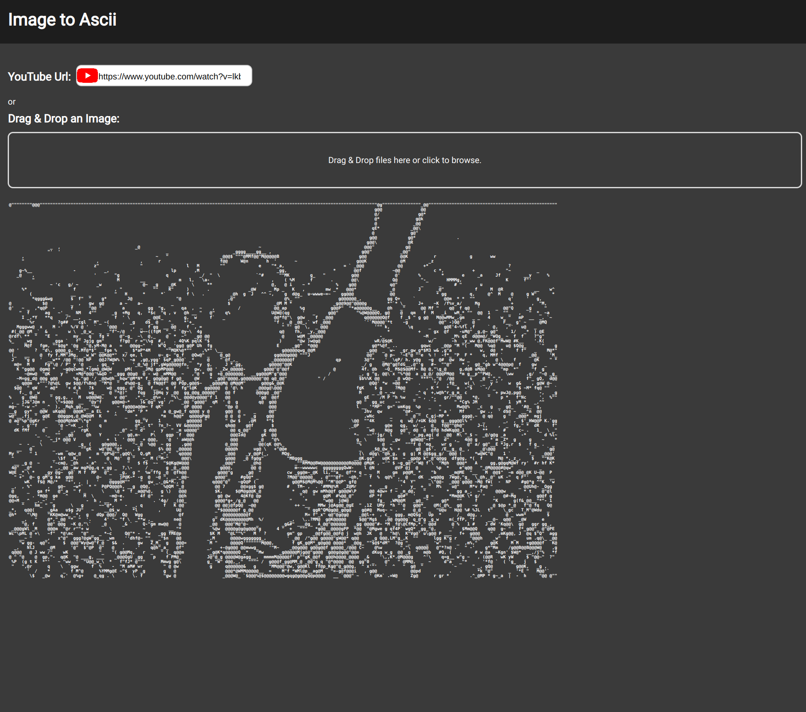
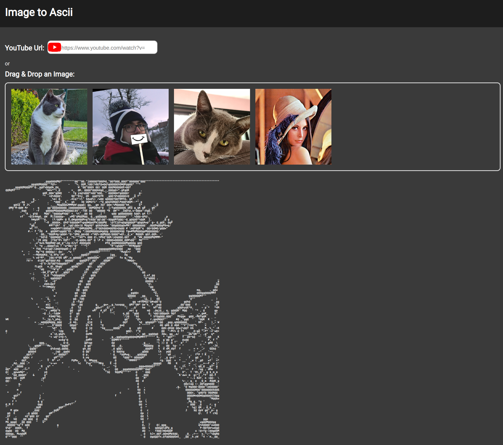

# Image to ASCII
## Project Description

The _**image_to_ascii.py**_ script is a tool for converting images to ASCII characters. It has two main components:

1. Creating an alphabet based on some desired characters and a font size.
1. Preprocessing an image.

### Creating an Alphabet
To create the alphabet, the script generates a fake HTML page for each desired character. It then cuts out the specific letter from the page and stores it as a numpy array.  
The script also calculates the height and width of the tallest and widest characters in the alphabet.


### Preprocessing an Image
The preprocessing steps for the target image include:

1. Converting the image to grayscale.
1. Applying Gaussian blur. This makes the image look slightly blurry and can be used to remove small details from the image.
1. Detecting edges using Canny edge detection.
1. Creating tiles of the image based on the height and width of the characters in the alphabet.

Given these steps, the script can now convert the image to ASCII art by:

1. For each tile, finding the character that has the smallest difference between the tile and the character image.
1. Reconstructing the predicted characters into a 2D array.

 ## Extra
This project also includes a web application for demo purposes. The web application has two parts:

 - YouTube video to ASCII
 - Image to ASCII
 
As the names suggest, these features allow users to convert a YouTube video into a series of ASCII frames or an image into an ASCII image. The web application uses the Flask framework and the SocketIO library to communicate with the Python server.

# Getting Started
To run the project, follow these steps:

### Prerequisites
You will need to have the following packages installed on your machine:

 - Image to ASCII module:
   - Python 3.7+
   - html2image
   - Pillow
   - NumPy
   - PyTorch
 - Web Application:
   - Flask
   - Flask Sockets
   - Flask SocketIO
   - youtube-dl
   - OpenCV
   - eventlet
   - gevent
   - gevent-websocket


You can install these libraries using pip:
```cmd
 pip install -r requirements.txt
 ```

### Running the Application
To start the application, run the run.py file in the root directory:

```cmd
 python run.py
 ```
This will start the Flask development server and the application will be available at http://localhost:5000.


## Notes
 - The YouTube event handler only downloads and processes videos that are <= 720p and have a frame rate <= 32 fps to ensure the best performance.


 # Demo: image_to_ascii.py
 In the following examples, the script is used to convert an image to ASCII art. The script is run using the following command:
 ```python
    # Load an image
    img = load_image_from_string('data/cat_3.png')
    
    # Create an alphabet
    letters, patterns, width, height = create_an_alphabet()

    # Create a convolution kernel with the patterns of our alphabet
    kernel = torch.stack(patterns, dim=0)[:,None,:,:]

    # Blur, edge detection, and tile the image
    processed_image = preprocess_image(img, height, width) 

    # Find the best match for each tile (euclidean distance)
    letter_index = ((processed_image - kernel)**2).mean(dim=(-2,-1)).argmin(dim=0).view(int(img.shape[0]/height), int(img.shape[1]/width)).numpy()

    # Get the result:
    result = letters[letter_index]
```

## Edge Detection:


## Result:


# Demo: Web Application
## YouTube to ASCII



## Image to ASCII


